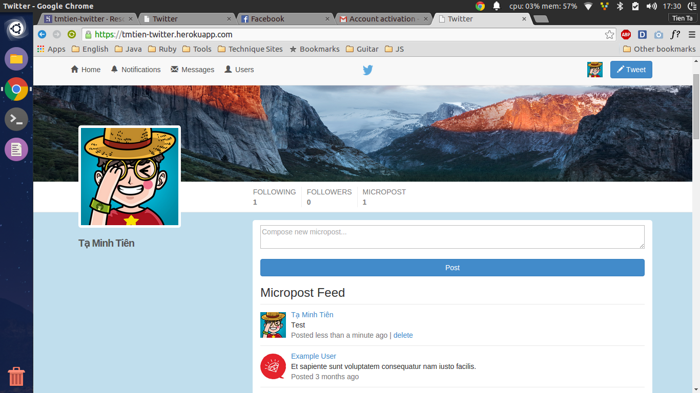

# Ruby on Rails Tutorial: sample application

This is the sample application for the
[*Ruby on Rails Tutorial:
Learn Web Development with Rails*](http://www.railstutorial.org/)
by [Michael Hartl](http://www.michaelhartl.com/).

# Home page

# Features

- I modified the UI of app to more similar with twitter's UI
- User management without using devise
- Ajax
- Unit test, functional test, integration test
- Mail activation with SendGrid
- Store image with AWS S3